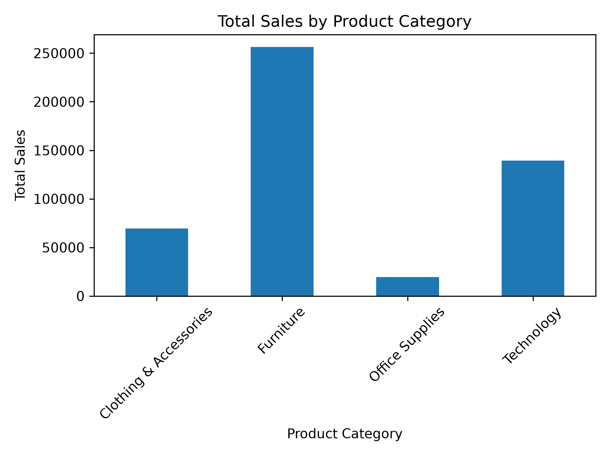
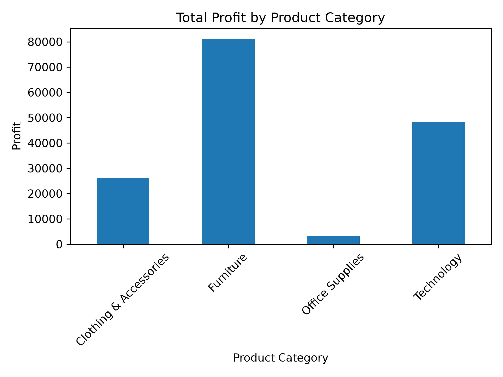
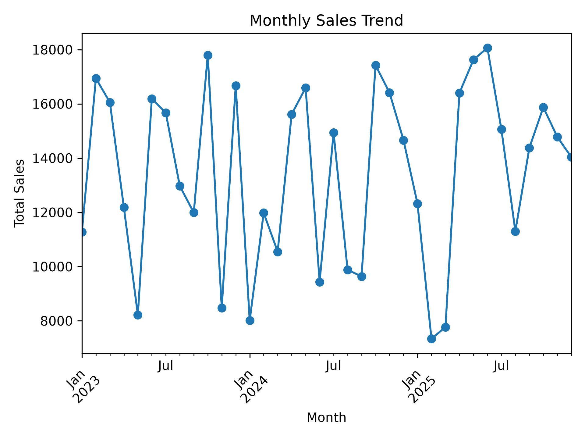
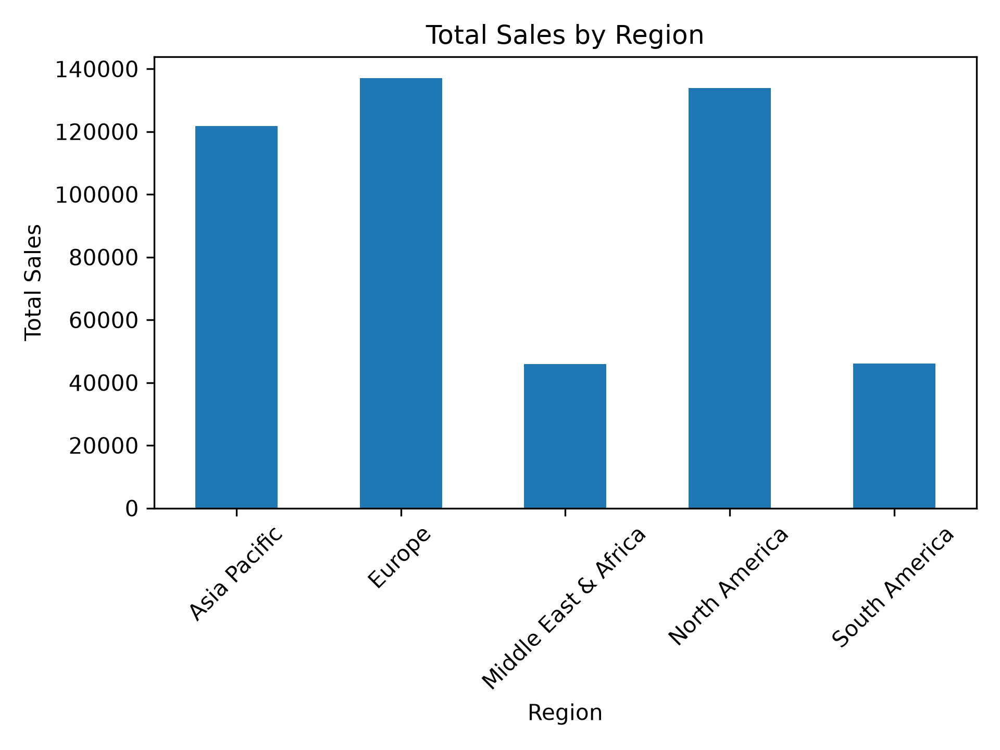
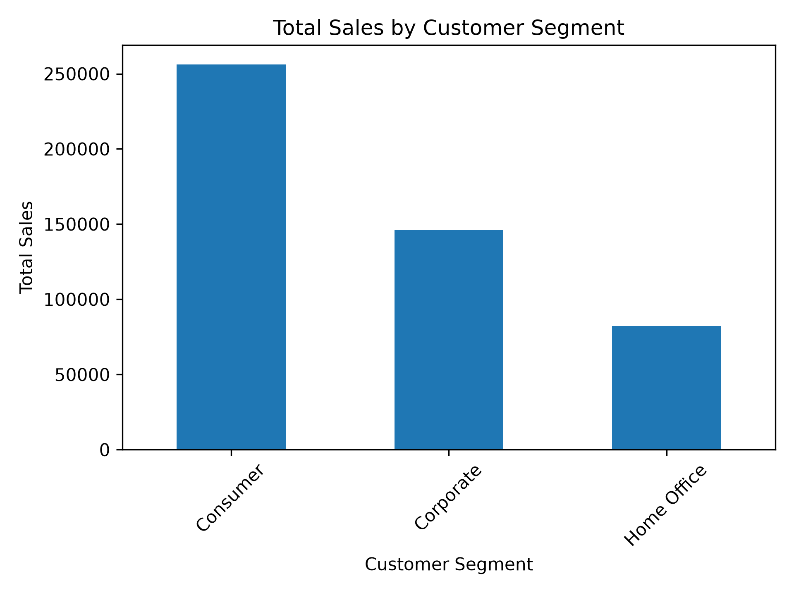
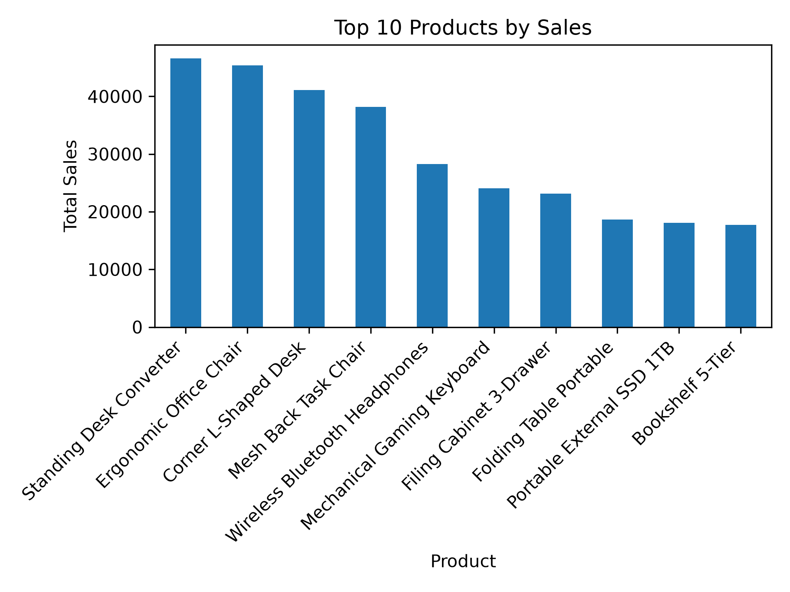
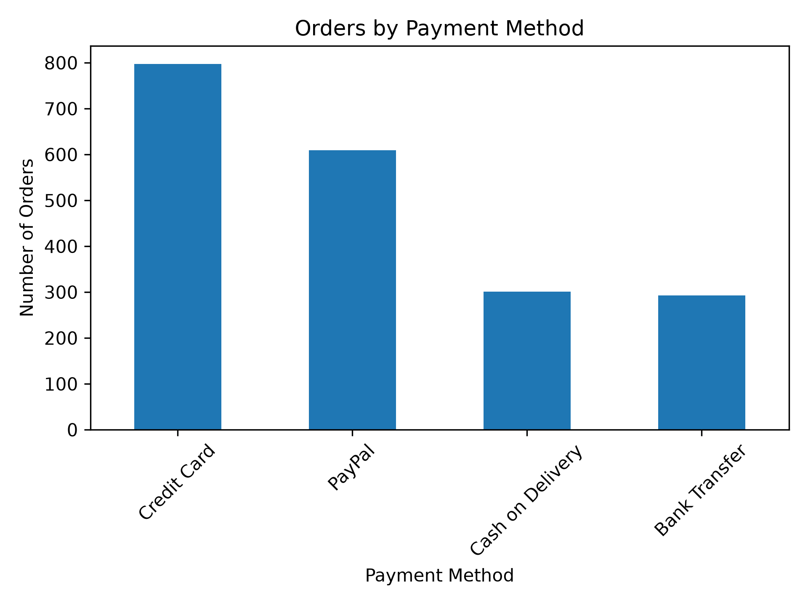
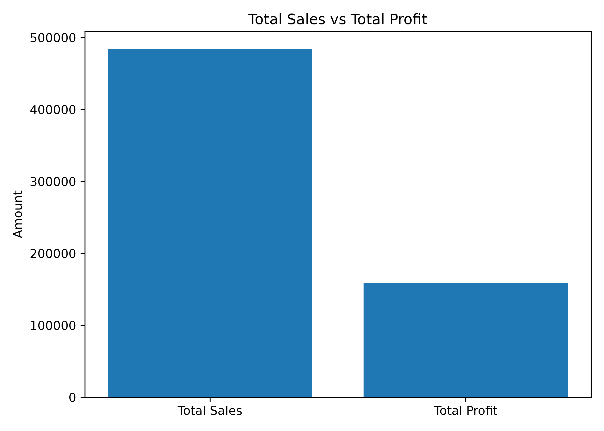
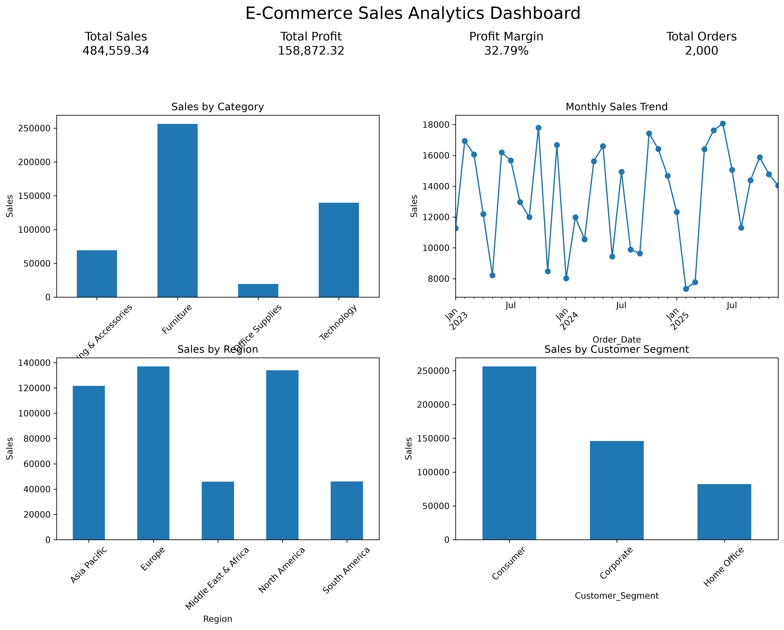

# 🛒 E-Commerce Sales Analytics

## 📌 Project Overview

This project analyzes e-commerce sales data using Python to uncover
meaningful insights into sales performance, profitability, customer
behavior, product performance, regional performance, and payment
preferences.

The project transforms raw e-commerce data into business insights
through data cleaning, exploratory data analysis, visualization, and
dashboard creation.

---

## 🎯 Project Objectives

- Analyze overall sales and profitability.
- Identify the best-performing product categories.
- Analyze monthly sales trends.
- Compare sales performance across regions.
- Understand customer segment performance.
- Identify top-selling products.
- Analyze customer payment preferences.
- Create an interactive-style analytical dashboard using visualizations.

---

## 📊 Dataset

The dataset contains:

- **2,000 e-commerce orders**
- **15 attributes**
- Order information
- Customer information
- Product information
- Sales and profit data
- Regional information
- Customer segments
- Payment methods

The dataset was used for educational and analytical purposes.

---

## 🛠️ Tools & Technologies

- **Python**
- **Pandas** – Data manipulation and analysis
- **Matplotlib** – Data visualization
- **Jupyter Notebook** – Analysis and documentation
- **CSV** – Dataset format
- **Git & GitHub** – Version control and project hosting

---

## 🔍 Analysis Performed

### 1. Sales & Profit Analysis

Calculated key business metrics including:

- Total Sales
- Total Profit
- Average Sales per Order
- Average Profit per Order
- Profit Margin

### 2. Category Analysis

Compared sales and profit across different product categories.

### 3. Monthly Sales Analysis

Analyzed sales trends over time to understand changes in monthly
business performance.

### 4. Regional Analysis

Compared sales and profit across different geographical regions.

### 5. Customer Segment Analysis

Analyzed sales and profit contribution from different customer
segments.

### 6. Product Analysis

Identified the top-performing products based on sales and profit.

### 7. Payment Method Analysis

Analyzed customer payment preferences and order distribution.

---

## 📈 Key Business Insights

- The dataset contains **2,000 e-commerce orders across 15 attributes**.
- The overall profit margin is **32.79%**.
- **Furniture** is the best-performing category in both sales and profit.
- **Europe** is the best-performing region by sales.
- **Consumer** is the top-performing customer segment.
- **Standing Desk Converter** is the top product by sales.
- **Credit Card** is the most used payment method.

---

## 💡 Business Recommendations

- Focus marketing and inventory efforts on high-performing product
  categories.
- Monitor monthly sales trends to improve sales planning and
  promotional strategies.
- Strengthen strategies in high-performing regions while investigating
  opportunities in weaker regions.
- Use customer segment insights to develop targeted marketing campaigns.
- Maintain sufficient inventory for top-selling products.
- Provide convenient and commonly preferred payment options to improve
  the customer checkout experience.

---

## 📊 Visualizations

### Sales by Category



### Profit by Category



### Monthly Sales Trend



### Regional Sales



### Customer Segment Sales



### Top 10 Products by Sales



### Payment Method Analysis



### Sales vs Profit



---

## 🚀 E-Commerce Sales Dashboard

The final dashboard provides a concise overview of the major business
metrics and sales trends.



---

## 📂 Project Structure

```text
Ecommerce-Sales-Analytics/
│
├── analysis/
│   └── analysis.ipynb
│
├── data/
│   └── global_ecommerce_sales.csv
│
├── visualizations/
│   ├── category_profit.png
│   ├── category_sales.png
│   ├── customer_segment_sales.png
│   ├── ecommerce_dashboard.png
│   ├── monthly_sales.png
│   ├── payment_method_orders.png
│   ├── region_sales.png
│   ├── sales_vs_profit.png
│   └── top_10_products_sales.png
│
└── README.md
